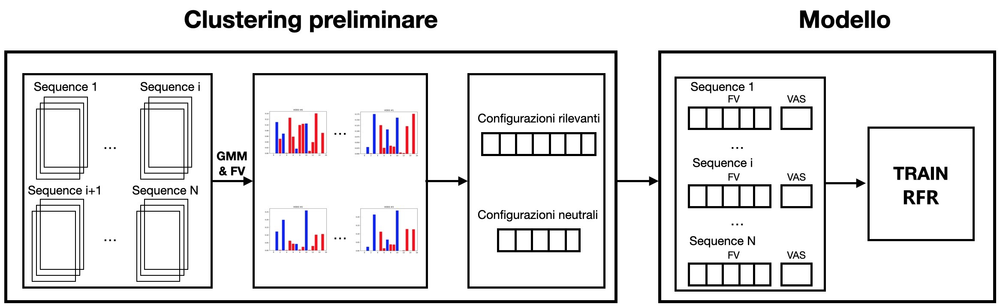
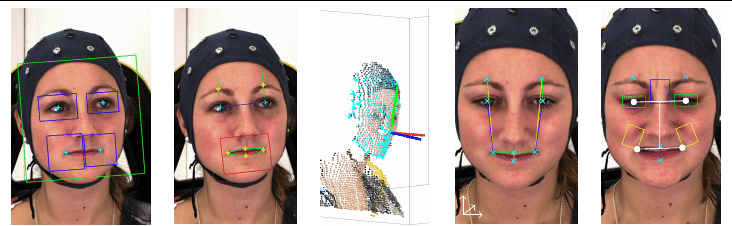
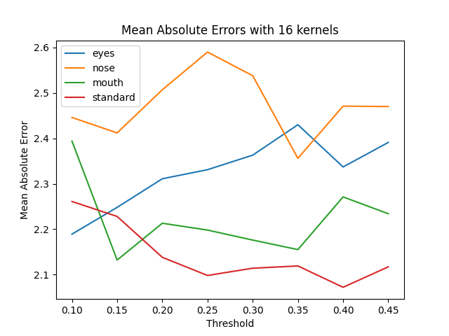

# Automatic-Recognition-VAS-Index-with-Random-Forest
## Table of Contents  
- [About the Project](#1)  
  - [Built with](#2)
- [Datasets](#3)
- [Implementation](#4)
- [Usage](#5)
  - [Installation](#6) 
  - [Run The Code](#7)
  - [Set the Parameters](#8)

# About the Project <a name="1"/>
 <br/>
Implementation of the Automatic Recognition with VAS Index (pain index) with the aim of demonstrating the effectiveness of the Random Forest on the problem. <br/>
This project has the task of extending and trying to improve the results obtained by our colleague [Alessandro Arezzo](https://github.com/AlessandroArezzo) in his [work](https://github.com/AlessandroArezzo/Automatic-Recognition-VAS-Index), using a different supervised learning model (Random Forest Regressor).

# Built with <a name="2"/>
- [Python](https://www.python.org/)
- [Scikit-learn](https://scikit-learn.org/stable/): It's a simple and efficient tools for predictive data analysis.

The Model is a Random Forest Regressor. A random forest is a meta estimator that fits a number of classifying decision trees on various sub-samples of the dataset and uses averaging to improve the predictive accuracy and control over-fitting.

# Datasets <a name="3"/>
The Datasets used are two:
- UNBC-McMASTER Shoulder Pain Expression : contains video sequences of patients' faces when they were actively and passively moving their shoulders following painful impulses. You can download it [here](https://datasets.bifrost.ai/info/1439).
- BioVid Heat Pain Database (BioVid) :  is a recent dataset created to improve the reliability and objectivity of pain measurement. <br/>
 You can download it [here](https://nextcloud.univ-lille.fr/index.php/s/MjFirkrqBZmbb7w).<br/>
  <br/>
# Implementation <a name="4"/>
The project is based on two scripts called ```PreliminaryClustering.py``` and ```ModelRFR.py```, which have the purpose of implementing respectively the phase suitable for extracting the relevant configurations and that relating to the management of Random Forest Regression. The script used to perform these tests is ```test_regression.py```, whose purpose is to be able to compare the results obtained when the value used as a threshold for neutral configurations varies and at the same time evaluate the different groupings of landmarks. This is done by scrolling through 5 groups of landmarks, representing in order the eyes, nose, mouth, the best configuration and all the landmarks. The other script implemented, called ```generate_model_predictor.py```, allows instead to evaluate the performance of a fixed model both the number of kernels of the GMM and the threshold to be used for the extraction of neutral configurations.

# Usage <a name="5"/>
## Installation <a name="6"/>
To install this project locally you need to clone this repository with the command
```sh
git clone https://github.com/LorenzoGianassi/Automatic-Recognition-VAS-Index-with-Random-Forest.git
```
## Run the Code <a name="7"/>
To run the code you can use one of this two script:
- ```generate_model_predictor.py``` : it performs the training of the model with a number of kernels of the GMM and a threshold of the neutral configurations. The number of kernels and the value of threshold used can be defined inside the file ```config.py```.<br/> At the end of the process a confusion matrix one for the test set and one train set are obtained. Futhermore a grapic representation of one randomly selected decision tree from the forest is generated.
- ```test_regression.py``` : it performs the training of the model by cycling over a set of thresholds definded a priori in ```config.py``` and a sets of definded landmarks.<br/> At the end of process a folder will be created for each group of landmarks. Inside of them the confusion matrices of train set and test set, the graphs of the mean absulute error, the decision trees and a graph of the total mean absolute error are generated threshold by threshold. Furthermore a graph containing the mean absolute error of each set of landmarks as shown in the figure below 
 <br/>
## Set the Parameters <a name="8"/>
To set the parameters you have to change the values inside the ```config.py``` file. <br/>
You can set the following parameters:
- type_of_database : the type of database can be set as 'BioVid' or 'original'. 'original' correspond to UNBC dataset.
- hyperparameter : if is set to 'True' the script ```test_regression.py```  will perform regression using ```RandomizedSearchCV()```.
- num_tree : if is set to 'True' the script ```generate_model_predictor.py``` will print the graph which report the gap between the results obtained on train and test set used to evaluate the overfit.
- cross_val_protocol : type of protocol to be used to evaluate the performance of the models. The type of protocol can be set as 'Leave-One-Subject-Out', '5-fold-cross-validation' or 'Leave-One-Sequence-Out'.
- selected_lndks_idx : it specifies the indexes of the landmarks to be considered during the procedure.
- n_jobs : number of threads to use to perform Random Forest Regressor training.
- thresholds_neutral_to_test : it defines the range of threshold values to be used in the ```test_regression.py``` script.
- n_kernels_GMM : it defines the number of kernels to be used for the Gaussian Mixture in the preliminary clustering phase.
The graphs representing the results are stored inside the ```data``` folder.
# Authors
- **Lorenzo Gianassi**
- **Francesco Gigli**
# Acknowledgments
Image and Video Analysis Project © Course held by Professor [Pietro Pala](https://www.unifi.it/p-doc2-2012-200006-P-3f2a3d30372e2a.html) - Computer Engineering Master Degree @[University of Florence](https://www.unifi.it/changelang-eng.html)
